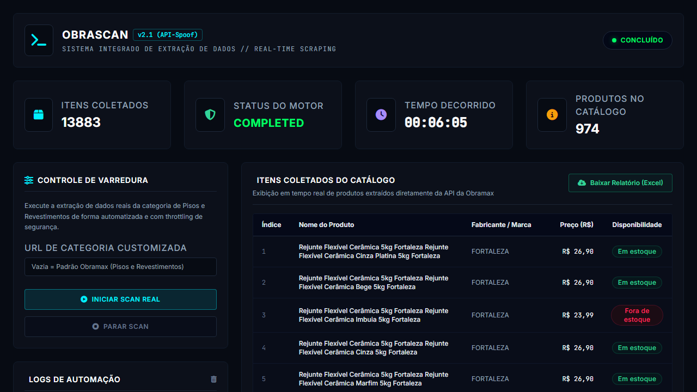
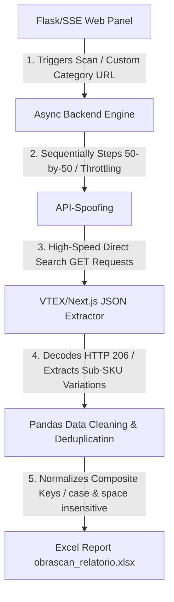

# Obrascan v2.1 — Advanced Real-Time E-Commerce Scraping & Data Pipeline

Author: **Marcos V. F. Guimarães** ([GitHub Portfolio](https://github.com/marcos-dataops))

Obrascan v2.1 is a high-performance, real-time data engineering and web scraping application engineered to bypass advanced anti-bot protections (like Cloudflare) and build clean, structured e-commerce product databases. Focusing on the "Pisos e Revestimentos" (Flooring & Wall Tiles) category of one of Brazil's largest construction wholesalers (Obramax), the system runs an automated extraction pipeline and presents it in a premium, real-time web dashboard.

---

## 🏗️ System Architecture

The following diagram illustrates the unidirectional data flow, from the client dashboard interaction down to the extraction, sanitization, and report generation:

---

## ⚡ Key Technical Solved Challenges

### 1. Cloudflare Anti-Bot Bypass via API-Spoofing
Visual browser automation tools (like Selenium or Playwright) suffer from severe latency and are easily detected and blocked by Cloudflare's JavaScript challenges. Obrascan v2.1 completely avoids browser automation by implementing **API-Spoofing**. It performs direct, low-latency raw HTTP GET requests mimicking the internal VTEX catalog/search endpoints used by the site's own frontend. This is completely immune to Cloudflare visual checks, fast, and does not require complex proxy rotations.

### 2. Deep VTEX Pagination & Resilient Parsing
The system steps sequentially in blocks of 50 products (`_from` and `_to` query parameters), checking response headers (`resources` and `content-range`) to capture the exact parent product catalog count (locked at `973` to prevent card inflation). The loop runs continuously and safely with a 2-second throttling delay until the endpoint returns an empty array `[]`, representing the absolute end of the catalog. The engine then processes and extracts all internal sub-SKUs/variations (size, color, lot) recursively.

### 3. In-Memory Semantic Sanitization & AI Cleanup
Raw scraped data often contains inconsistent brand labels and repetitive strings. Obrascan v2.1 utilizes an **LLM Analytical Cleaner** (supporting Gemini, OpenAI, and Groq) in a multi-model fallback wrapper to post-process strings. It identifies brand names directly from context and sanitizes the listings. A secure Python lookup map reconciles raw scraped product URLs with the LLM output to guarantee 0% data corruption or URL hallucination.

### 4. High-Fidelity Real-Time Dashboard (SSE)
Instead of relying on heavy WebSockets or refreshing the page, Obrascan v2.1 streams raw terminal logs and metric updates in real-time to the premium ultra-dark dashboard using **Server-Sent Events (SSE)**. It implements an strict visual state reset on load (GET `/` metrics strictly initialized to zero until the scan starts).

### 5. Multi-Column Case-Insensitive Deduplication
E-commerce catalogs contain duplicate rows and spacing discrepancies. The data pipeline utilizes a Pandas deduplication module which normalizes strings using `.str.strip().str.lower()` on a composite key composed of `Nome do Produto` + `Fabricante / Marca` + `URL do Produto`.

---

## 📺 Live Demonstration

The animated demonstration below captures the real-time operational flow of the system. Notice the live logs streaming through the terminal console, cards dynamically updating, and the final spreadsheet report compiling:

---

## 📄 Showcase Disclaimer & Copyright

> [!NOTE]
> This repository is a **showcase portfolio** representing the architectural design, frontend interface, and data engineering achievements of the project. The core scraper and backend source code (`obrascan-core`) are hosted in a secure, private repository to comply with copyright regulations and protect proprietary logic.

© 2026 Marcos V. F. Guimarães (@marcos_dataops). All Rights Reserved.
